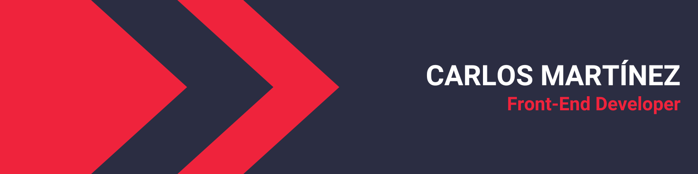

# 📕 About

Front-End Developer passionate about creating web pages that stand out for their great style. 💻✨

## 📌 Pinned Repositories

   

## 📈 GitHub Stats

## 💼 Skills

### Programming Languages

### Libraries & Frameworks

### Tools & Platforms

